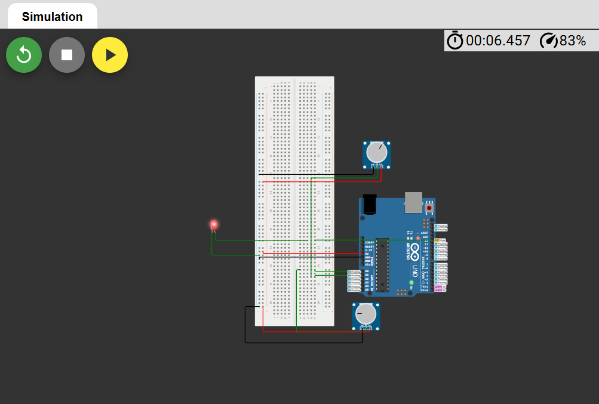
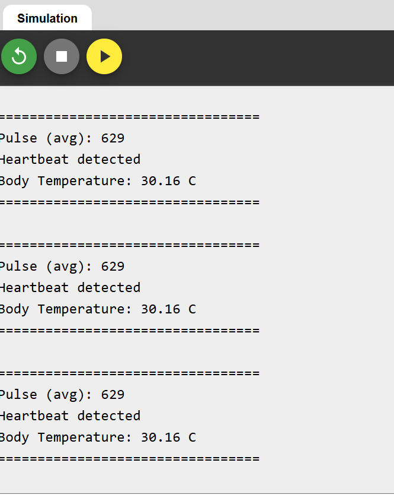

# Wearable Health Monitor v1

Hi, welcome! I am Kevin Bekoe and this is a simple simulation of a basic wearable health monitor system using Arduino and Wokwi.

## 🛠 Features
- Pulse signal detection (simulated with a potentiometer)
- Signal smoothing for more stable readings
- Body temperature monitoring ( simulated with a second Potentiometer)
- Real-time alerts:
  - Heartbeat detection
  - Fever detection (Temperature > 38°C)

## ⚙️ Technologies used
- Arduino Uno
- Wokwi online simulator
- Basic electronic components (potentiometers, LED)

## 🧩 Components
- Arduino uno
- 2x Potentiometers (simulating the sensors)
- 1x LED (heartbeat alert)
- Wires and Breadboard

## Demo screenshots

### Circuit Diagram

### Serial Monitor Output

## How it works
- ** Heartbeat Detection:**
The potentiometer (p1) simulates a pulse sensor.
If the analog signal crosses a threshold, the system detects a heartbeat and the LED lights up.

- **Temperature Monitoring:**
The second potentiometer (p2) simulates a TMP36 temperature sensor.
The Arduino calculates body temperature based on the voltage and triggers a fever warning if needed.

## 🚀 Future Improvements
- Add a real pulse sensor and TMP36/MLX90614 temperature sensor
- Add an OLED screen for real-time data display
- Add wireless data transmission (Bluetooth / WiFi)
- Build an actual wearable prototype!

## Learning Goals
- Arduino coding fundamentals
- Analog signal processing (smoothing signals)
- Real-time health data monitoring
- GitHub and Project Documentation skills

## Author
Created with ❤️ by Kevin Bekoe  
Link to simulate on Wokwi wokwi.com/projects/429380018550649857

## 📜 License
This project is open-source and free to use for educational purposes.
